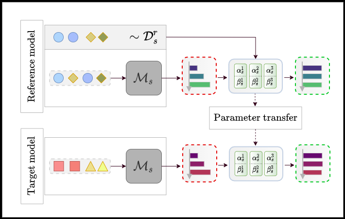

<div align="center">
<h1 align="center">
    Dataset Knowledge Transfer for Class-Incremental Learning Without Memory
</h1>

[](https://www.python.org/)
[](https://pytorch.org/)

\[[Paper](https://arxiv.org/abs/2110.08421)\] \[[Slides](http://todo.todo)\]

<p align="center">
    
</p>
</div>


## Summary

* [Introduction](#introduction)
* [Installation](#installation)
* [Reproducing results](#reproducing-results)
* [Citation](#citation)
* [Acknowledgments](#acknowledgments)

## Introduction

This repository contains the PyTorch implementation for the [WACV 2022](https://wacv2022.thecvf.com/) Paper ["Dataset Knowledge Transfer for Class-Incremental Learning Without Memory"](https://arxiv.org/abs/2110.08421).
This paper is the result of an internship research project conducted at [CEA-LIST](http://www-list.cea.fr/en/). Our work tackles bias-correction in incrementally learned models when no rehearsal memory is available (check out the [paper](https://arxiv.org/abs/2110.08421) for more info!).

Feel free to open a GitHub issue if you encounter any problem with the code, or if you have any question about the paper.


## Installation

Install the environments required to run the project with the following commands:

```bash
conda env create -f ./envs/FACIL.yml
conda env create -f ./envs/iCaRL.yml
```

For more details, read the <code>./envs/README.md</code> file.
You will also need to extract image lists if you want to reuse the datasets presented in our paper. In order to do that, you can check the <code>./datasets/README.md</code> file.

## Reproducing results

To reproduce results reported in our paper, we pre-extracted output scores on top of __LUCIR__ and __LwF__ and provide them in this repository for __CIFAR-100__ and __S=10__. Run the following command:

```bash
source ./scripts/run_eval.sh {lucir or lwf}
```

For instructions on how to train and run on top of all other methods/datasets, please read the <code>./scripts/README.md</code> file.


## Citation

If our paper is helpful for your work, please consider citing it!

```bibtex
@inproceedings{slim2022_transil,
    author    = {Slim, Habib and Belouadah, Eden and Popescu, Adrian and Onchis, Darian},
    title     = {Dataset Knowledge Transfer for Class-Incremental Learning Without Memory},
    booktitle = {The IEEE/CVF Winter Conference on Applications of Computer Vision (WACV)},
    year      = {2022}
}
```

## Acknowledgments

This repository uses source code from repositories listed below:

* [FACIL Framework](https://github.com/mmasana/FACIL)

* [LUCIR](https://github.com/hshustc/CVPR19_Incremental_Learning)

* [iCaRL (LwF)](https://github.com/srebuffi/iCaRL)
